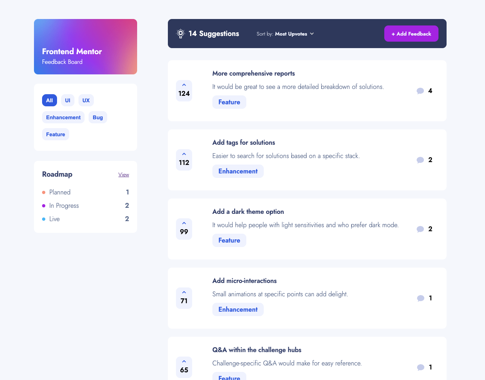
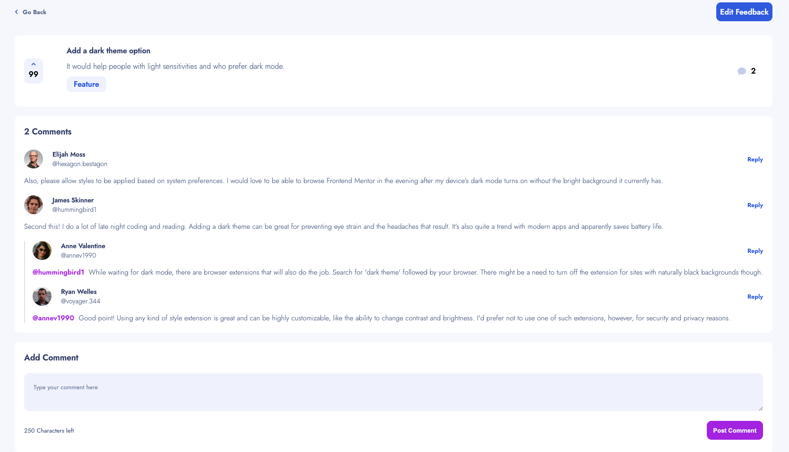
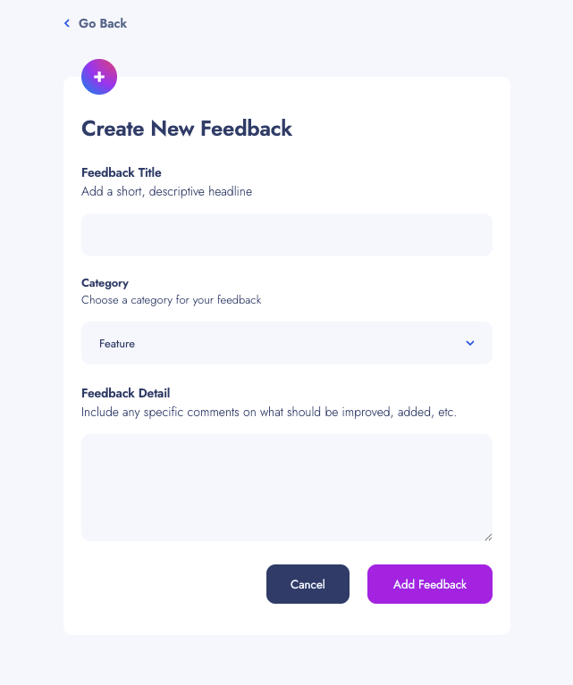
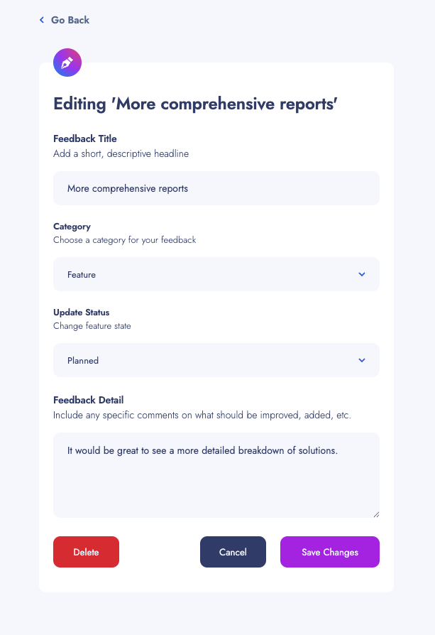
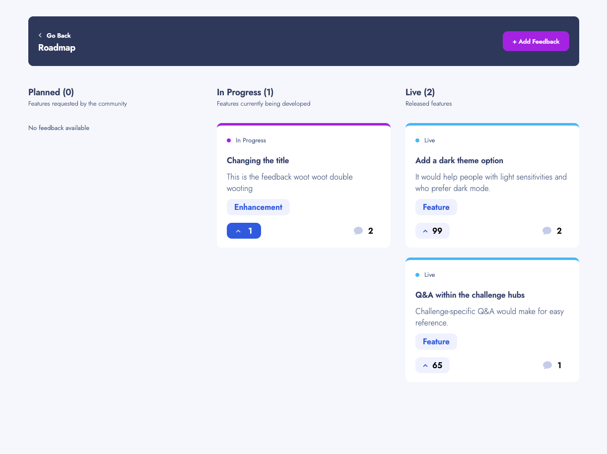

# Frontend Mentor - Product feedback app solution

This is a solution to the [Product feedback app challenge on Frontend Mentor](https://www.frontendmentor.io/challenges/product-feedback-app-wbvUYqjR6). Frontend Mentor challenges help you improve your coding skills by building realistic projects.

## Table of contents

- [Frontend Mentor - Product feedback app solution](#frontend-mentor---product-feedback-app-solution)
  - [Table of contents](#table-of-contents)
  - [Overview](#overview)
    - [The challenge](#the-challenge)
    - [Screenshot](#screenshot)
    - [Links](#links)
  - [My process](#my-process)
    - [Built with](#built-with)
  - [Author](#author)

## Overview

### The challenge

Users should be able to:

- View the optimal layout for the app depending on their device's screen size
- See hover states for all interactive elements on the page
- Create, read, update, and delete product feedback requests
- Receive form validations when trying to create/edit feedback requests
- Sort suggestions by most/least upvotes and most/least comments
- Filter suggestions by category
- Add comments and replies to a product feedback request
- Upvote product feedback requests
- **Bonus**: Keep track of any changes, even after refreshing the browser (`localStorage` could be used for this if you're not building out a full-stack app)

### Screenshot

Main view:

Feedback Detail:

Feedback Create:

Feedback Edit:

Roadmap view:

### Links

- Solution URL: [Repository Hosted on GitHub](https://github.com/ejparnell/product-feedback-app)
- Live Site URL: [Deployed on Netlify]()

## My process

### Built with

- Semantic HTML5 markup
- CSS modules
- Flexbox
- CSS Grid
- Mobile-first workflow
- [React](https://reactjs.org/) - JS library
- [Vite](https://vitejs.dev/) - Build tool

## Author

- Website - [Beth Parnell](https://www.your-site.com)
- LinkedIn - [@elizabethjparnell](https://www.linkedin.com/in/elizabethjparnell/)
